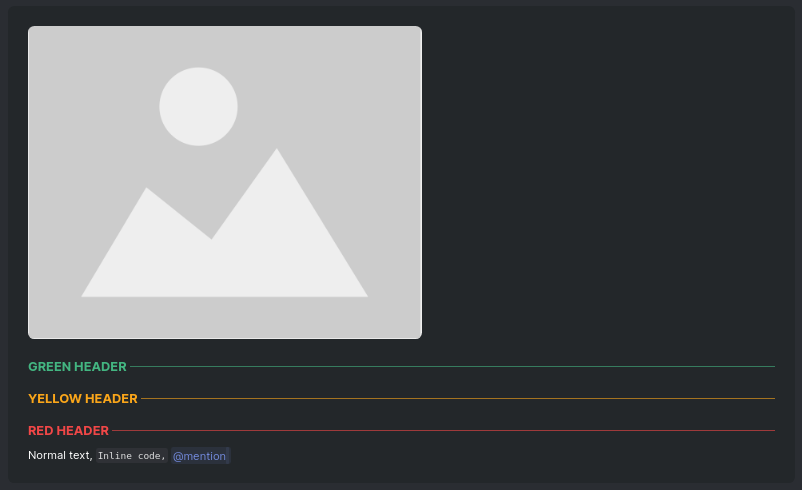

# DBDS
Discord Bot Description Styling - Makes my bot descriptions look pretty

## What is this thing?
DBDS (or Discord Bot Description Styling) is a bit of CSS that I use to make the descriptions of my Discord bots look similair to the UI of Discord itself. (Made for [top.gg](https://top.gg), not tested on other platforms.)

## What does it look like?
As of now, this:


## How can I use DBDS?
Firstly, you need to include this at the top of your bot description:
```html
<style>
    @import url('https://raw.githack.com/Controlfreak707/DBDS/main/css/index.css');
</style>
```

After that, you can style your description like so:

### Headers
```html
<h1 class="h1-{colour}">Whatever you put here will be capitalized.</h1>
```
Replace `{colour}` with `blurple|green|yellow|red`.

### Alert Boxes
```html
<div class="alert-box {type}">
    <blockquote>
        Your text goes here.
    </blockquote>
</div>
```
Replace `{type}` with `info|warn|danger`.

### Mentions
```html
<span>@Mention</span>
```

### Inline code
```html
<code>var message = "Hello World!";</code>
```
OR
```md
`var message = "Hello World!";`
```